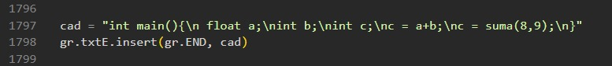
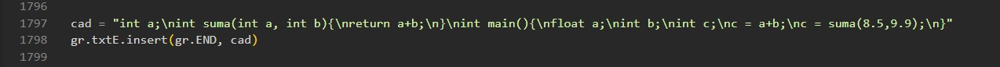
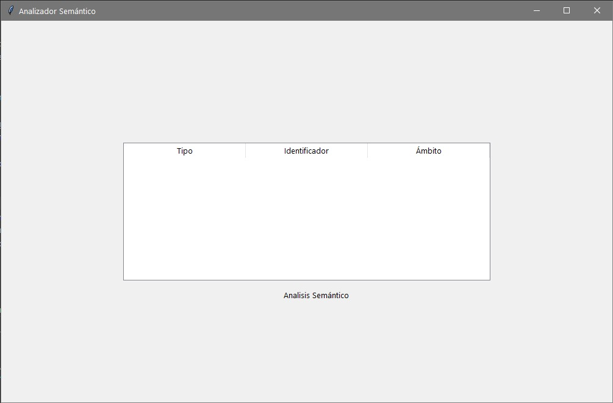
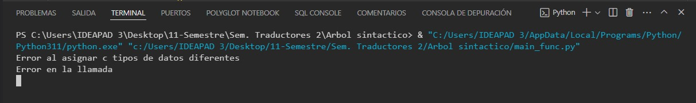
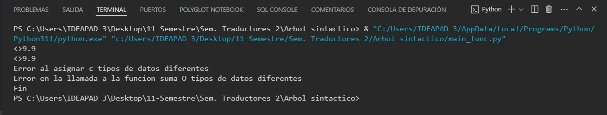

# Etapa:  Analizador semántico.
**Universidad de Guadalajara Centro Universitario de Ciencias e Ingenierías**

 <br>

Departamento de Ciencias Computacionales

SEMINARIO DE SOLUCION DE PROBLEMAS DE TRADUCTORES DE LENGUAJES II

Profesor: Michel Emanuel López Franco

Alumno: Torres Hernández David

Código: 215428899	     	Carrera: INCO		Sección: D02		Fecha: 06/05/2024


## **Introducción:**

Producto a subir.

Código de tu analizador semántico y un reporte con captura de pantalla de la validación semántica de los siguientes códigos.


## **Desarrollo:**
Ejemplos a usar: <br>
- Ejemplo 1: 
```python
int main(){
float a;
int b;
int c;
c = a+b;
c = suma(8,9);
}
```

- Ejemplo 2: 
```python
int a;
int suma(int a, int b){
return a+b;
}

int main(){
float a;
int b;
int c;
c = a+b;
c = suma(8.5,9.9);
}
```

- Mostramos el mismo ejemplo pero en el archivo de paython analizador.py (linea 1797): <br>
  Ejemplo 1:
  
   <br>
  Ejemplo 2:
  
   <br>

## Mostramos su salida
La salida al meter los ejemplos 1 y 2 nos damos cuenta que ambas tienen error semanticos y es por eso que nos aparece en blanco la tabla del analizador semántico:
 <br>
A continuación veremos estos error mas a fondo.

### Ejemplo 1:

- En la línea c = a+b;, estás asignando el resultado de sumar un valor float (a) con un valor int (b) a una variable int (c). Esto generará un error de tipo ya que estás tratando de asignar un valor de punto flotante a una variable entera.

- En la línea c = suma(8,9);, estás llamando a una función suma, pero no parece estar definida en el código proporcionado. Si tienes una función llamada suma, debe estar definida antes de ser llamada.

- Asumiendo que suma sea una función definida en otro lugar del código, si está diseñada para sumar dos valores enteros, deberías declararla antes de usarla. Por ejemplo, podrías incluir un prototipo de función al principio del código para evitar errores.

 <br>

### Ejemplo 2:

- En la línea c = a+b;, estás intentando sumar un valor float (a) con un valor int (b). Esto generará un error ya que estás tratando de sumar tipos de datos incompatibles.

- En la línea c = suma(8.5,9.9);, estás pasando argumentos de tipo float a una función (suma) que espera argumentos de tipo int. Esto también generará un error ya que los tipos de datos no coinciden.

 <br>
