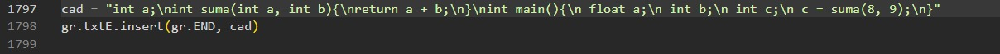
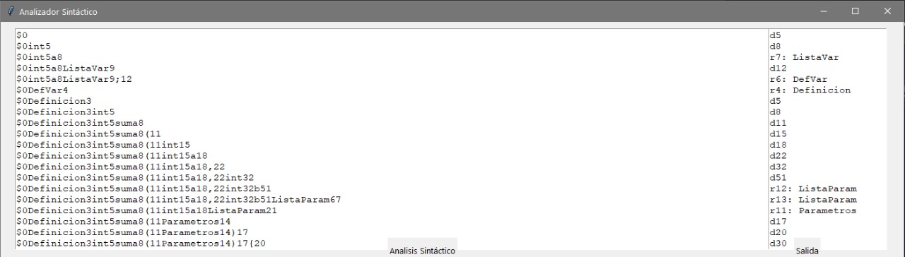
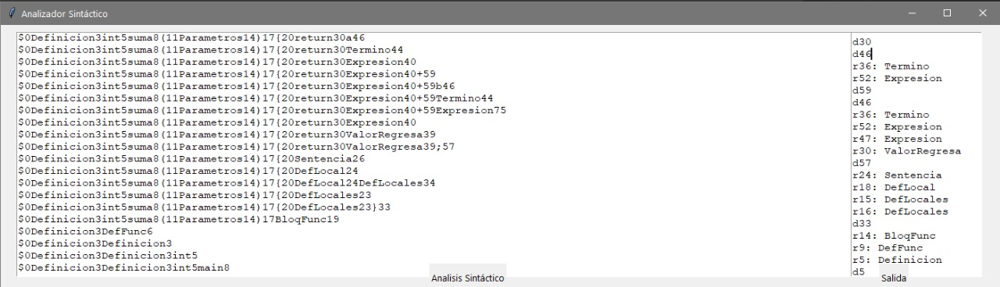
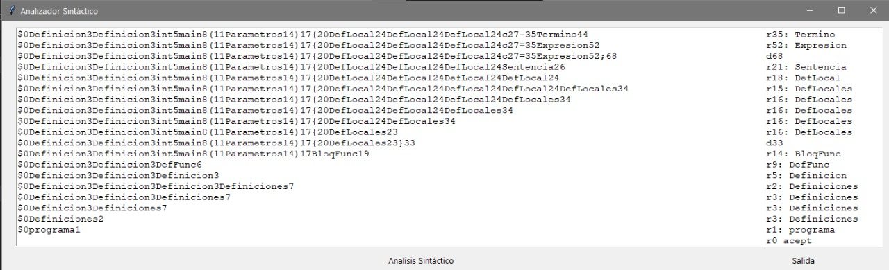
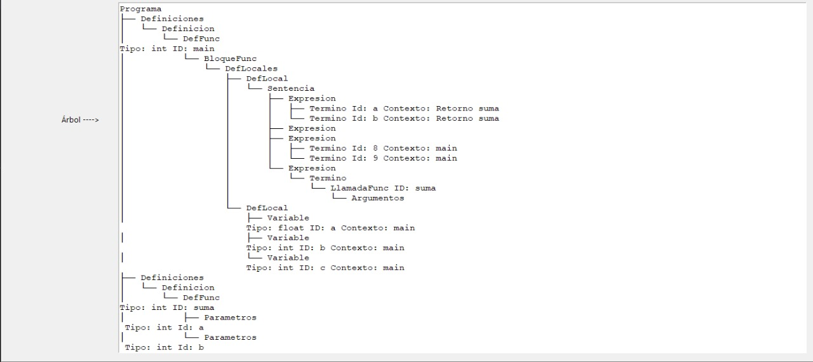
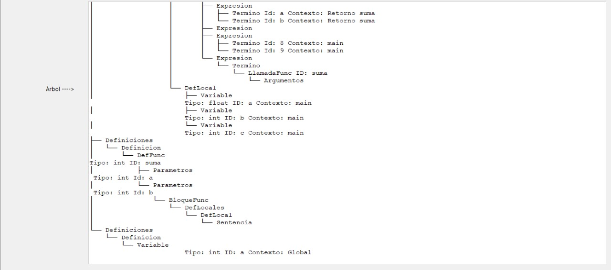

# Etapa: árbol sintactico.
**Universidad de Guadalajara Centro Universitario de Ciencias e Ingenierías**

 <br>

Departamento de Ciencias Computacionales

SEMINARIO DE SOLUCION DE PROBLEMAS DE TRADUCTORES DE LENGUAJES II

Profesor: Michel Emanuel López Franco

Alumno: Torres Hernández David

Código: 215428899	     	Carrera: INCO		Sección: D02		Fecha: 29/04/2024


### **Introducción:**

En esta etapa se mostrara el resultado del árbol sintactico. <br>

### **Desarrollo:**
- Ejemplo a usar: <br>
```python
  int a;
  int suma(int a, int b){
  return a+b;
  }

  int main(){
  float a;
  int b;
  int c;
  c = a+b;
  c = suma(8,9);
  }
```

- Mostramos el mismo ejemplo pero en el archivo de paython analizador.py (linea 1797): <br>
 <br>

## Mostramos su salida 
Con la ayuda de la librería TKinter el programa lo pondrá en una interfaz gráfica que ayudara a observar mejor los resultados.
 <br>
Podemos observar que la pila hace correctamente las inserciones y las reducciones.
 <br>

Por último observamos que la pila llega al estado de aceptación:

 <br>

- Mostrar Árbol:
 <br>
 <br>
