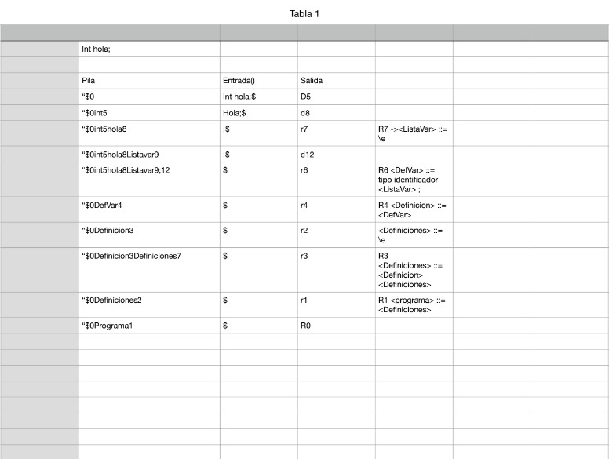
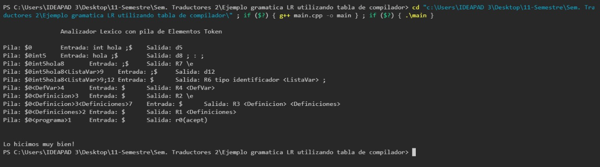

# Ejemplo gramática LR utilizando tabla de compilador.

**Universidad de Guadalajara Centro Universitario de Ciencias e Ingenierías**

 <br>

Departamento de Ciencias Computacionales

SEMINARIO DE SOLUCION DE PROBLEMAS DE TRADUCTORES DE LENGUAJES II

Profesor: Michel Emanuel López Franco

Alumno: Torres Hernández David

Código: 215428899	     	Carrera: INCO		Sección: D02		Fecha: 11/03/2024


### **Introducción:**

Esta practica es igual a la anterior pero se utiliza como entrada "int hola;" y se analiza con la gramatica anteriormente dada. <br>

### **Desarrollo:**
- Entrada y Salida Esperada: <br> 

 <br>


- Mostramos la misma entrada en el lenguaje C++: <br>
```c++
    static void analizadorLexico()
{
    // string cadena1 = "hola + mundo";
    // string cadena1 = "a + b + c + d + e + f";
    //string cadena1 = "int a ; int main ( ) { int b ; }";
    string cadena1 = "int hola ;";
    //  cout<<"Cadena: ";
    //  getline(cin, cadena1);
    string cadena2 = "";
    int largo1 = cadena1.length();
    int largo2;
    bool especial = false;
    int tipo;
```
## Mostramos su salida 

 <br>
