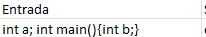
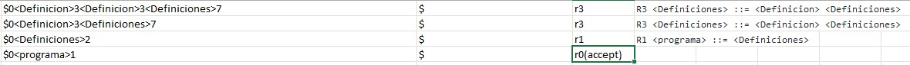
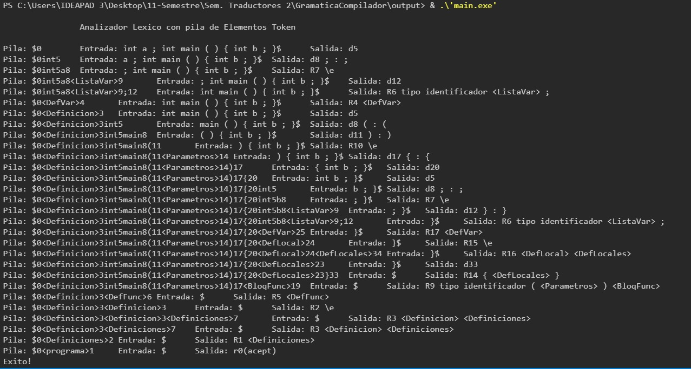

# Gramática del compilador

**Universidad de Guadalajara Centro Universitario de Ciencias e Ingenierías**

 <br>

Departamento de Ciencias Computacionales

SEMINARIO DE SOLUCION DE PROBLEMAS DE TRADUCTORES DE LENGUAJES II

Profesor: Michel Emanuel López Franco

Alumno: Torres Hernández David

Código: 215428899	     	Carrera: INCO		Sección: D02		Fecha: 4/03/2024


### **Introducción:**

Utilizando tu analizador léxico y tu algoritmo para trabajar con las tablas lr. 

Carga e implementa la siguiente gramática.

https://github.com/TraductoresLenguajes2/Traductores/tree/master/Modulo4

### **Desarrollo:**

En esta nueva etapa para la creación de un compilador para el lenguaje C++, el programa será capaz de analizar sintácticamente una oración digitada por el usuario. <br>
A diferencia de la etapa anterior, ésta será capaz de actuar basándose en más reglas. <br>
- Comprobaremos su funcionamiento con el siguiente ejemplo: <br>

 <br>

- Salida esperada: <br>


- Mostramos la misma entrada en el lenguaje C++: <br>
```c++
    string cadena1 = "int a ; int main ( ) { int b ; }";
    string cadena2 = "";
    int largo1 = cadena1.length();
    int largo2;
    bool especial = false;
    int tipo;

```
## Mostramos su salida y observamos que es la misma que en el ejemplo

 <br>
