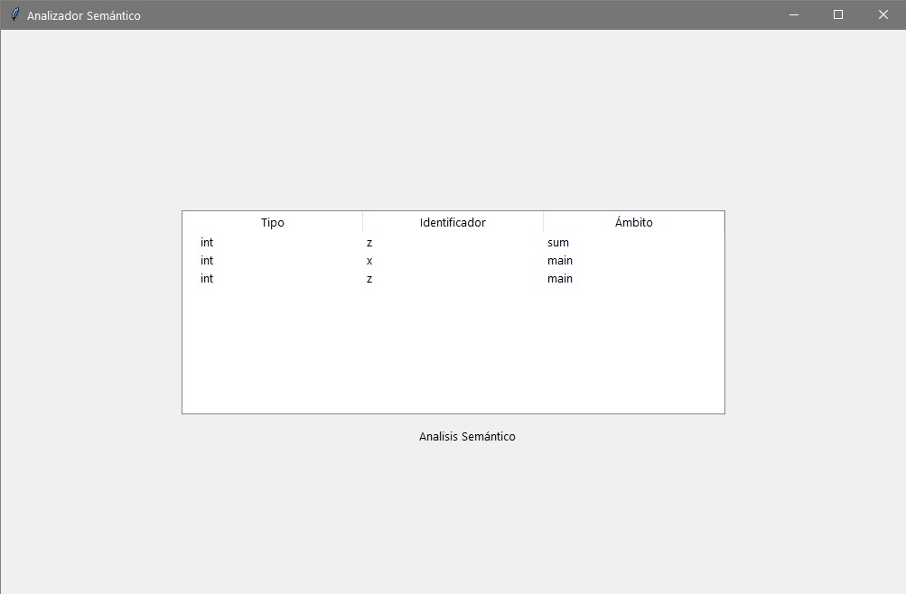
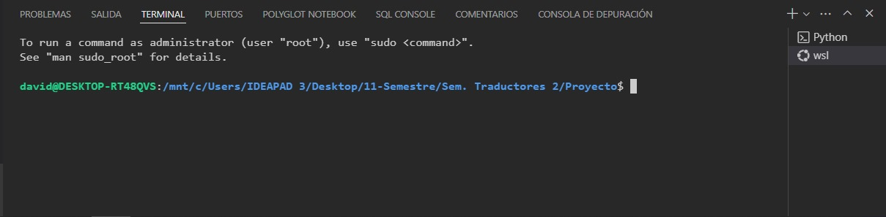

# Proyecto Final.
**Universidad de Guadalajara Centro Universitario de Ciencias e Ingenierías**

   <br>

Departamento de Ciencias Computacionales

SEMINARIO DE SOLUCION DE PROBLEMAS DE TRADUCTORES DE LENGUAJES II

Profesor: Michel Emanuel López Franco

Alumno: Torres Hernández David

Código: 215428899	     	Carrera: INCO		Sección: D02		Fecha: 13/05/2024


### **Introducción:**

En este reporte se representara el traductor completo <br>

### **Desarrollo:**
- Ingresamos la siguiente entrada: <br>
```python
int sum(int a){
  int z;
  z = a + 2;
  return z;
}
int main(){
  int x;
  int z;
  x = 20;
  z = 12;
  z = sum(x);
  print(z)
  return z;
}
```
- Mostramos el Analizador léxico: <br>
 <br>

- Mostramos el Analizador semántico:
   <br>

- Mostramos el Analizador sintáctico:
   <br>

## Mostramos el archivo de ensamblador que genero el programa
- Modificamos la linea 9 donde se encuentra el main y lo ponemos global:
   <br>
   <br>
  
- Abrimos una distribucion WLS de Ubuntu en la terminar de abajo:
  
   <br>
   <br>
  
- Por último ingresamos los siguientes comandos y veremos el resultado:
  ```linux
  nasm -f elf64 ensamblador.asm
  gcc -no-pie ensamblador.o -o salf
  ./salf
  ```
   <br>
